# Serveless with Fn on DigitalOcean

[Fn](http://fnproject.io/) is an open-source container-native serverless platform. Let's setup and play around with **Fn** on [DigitalOcean](https://digitalocean.com)

We will make use of

- [One-click app](https://www.digitalocean.com/products/one-click-apps/) to quickly standup Docker in the cloud
- [Spaces](https://www.digitalocean.com/products/spaces/) (a S3 compatible store)
	- **Fn** will use **Spaces** as its log store
	- Demonstrate how to connect to Spaces using [AWS S3 Go client](https://docs.aws.amazon.com/sdk-for-go/api/service/s3/)

## Create Droplets

Use one-click app to bootstrap Docker - just follow [this tutorial](https://www.digitalocean.com/community/tutorials/how-to-use-the-digitalocean-docker-application)

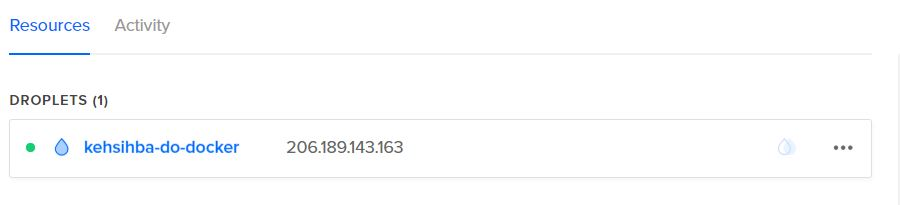
=======

## Create Space

Super easy - check out [the documentation](https://www.digitalocean.com/docs/spaces/how-to/create-and-delete/)

> same can be done using [its API](https://developers.digitalocean.com/documentation/spaces/) as well

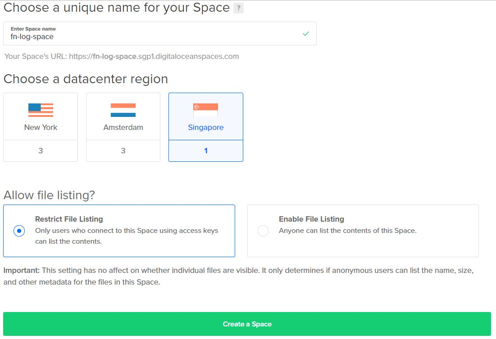

Done !

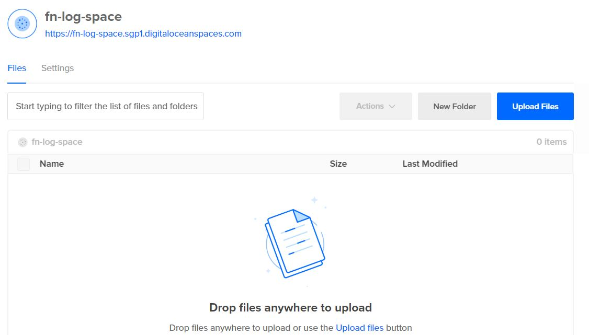

### Create Access Keys for your Space

Follow [the documentation](https://www.digitalocean.com/docs/spaces/how-to/administrative-access/)

Copy and keep this safely

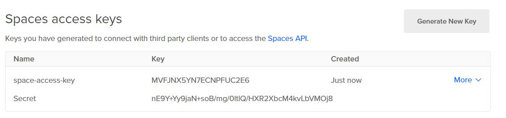

## Up and running with Fn

Time to setup Fn in our Docker droplet

First, [SSH into your Droplet](https://www.digitalocean.com/docs/droplets/how-to/connect-with-ssh/) 

-  `git clone https://github.com/abhirockzz/just-DO-it.git`
-  `cd do-fn`
-  enter Space related details in `docker-compose.yml` (update `FN_LOGSTORE_URL` in the `fnserver` service)
	-  `<DO_SPACE_KEY>` - space key (created above)
	-  `<DO_SPACE_SECRET>` - space secret (created above)
	-  `<DO_SPACE_REGION>` - region (e.g. `nyc3`, `sgp1` etc.)
	-  `<DO_SPACE_ENDPOINT>` - endpoint (format `${REGION}.digitaloceanspaces.com`)
	-  `<DO_SPACE_NAME>` - name of the Space
-  `docker-compose up`

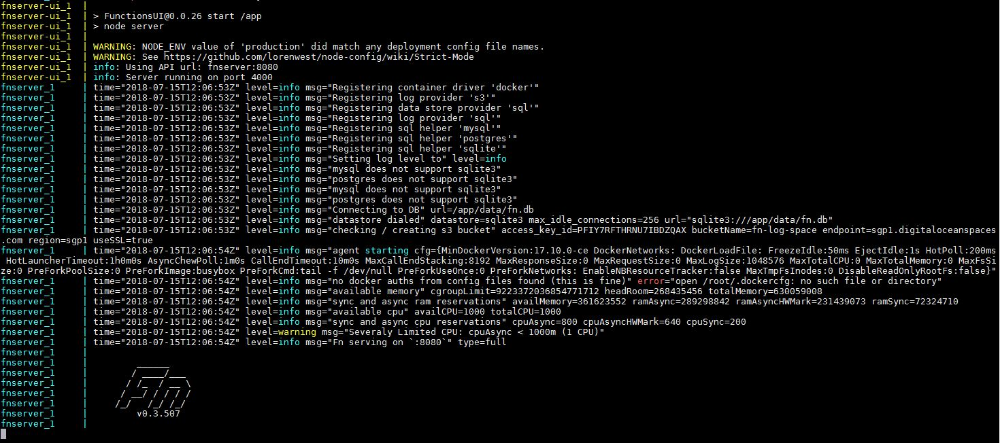

-  check Fn UI - `http://<DROPLET_IP>:4000`

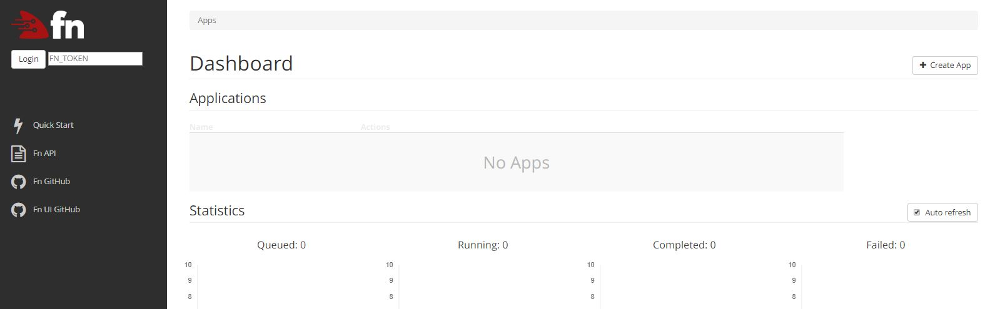

- Install [Fn cli](https://github.com/fnproject/cli) - in your Droplet, execute `curl -LSs https://raw.githubusercontent.com/fnproject/cli/master/install | sh`

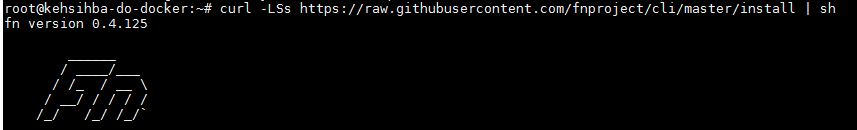

- Scaffold a Go function - `fn init --runtime go hello`

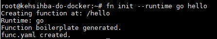

- `cd hello`

- deploy it to Fn server - `fn deploy --app myapp --local`

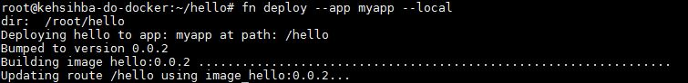

- check Fn UI - the app `myapp` should show up

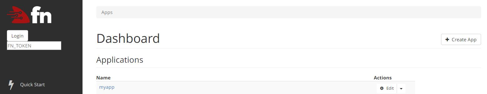

App details

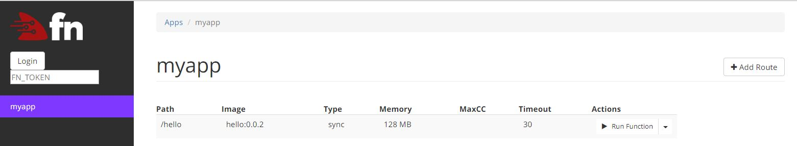

- Invoke the function - `curl -d '{"Name" : "abhi"}' http://localhost:8080/r/myapp/hello`. You will get JSON `{"message":"Hello abhi"}` as response

> to invoke the function from your local machine, replace `localhost` with the IP address of the droplet e.g. `curl -d '{"Name" : "abhi"}' http://206.189.143.163:8080/r/myapp/hello`

 
## Check Spaces

Let's check the Fn server logs which were pushed to the Space we had created earlier

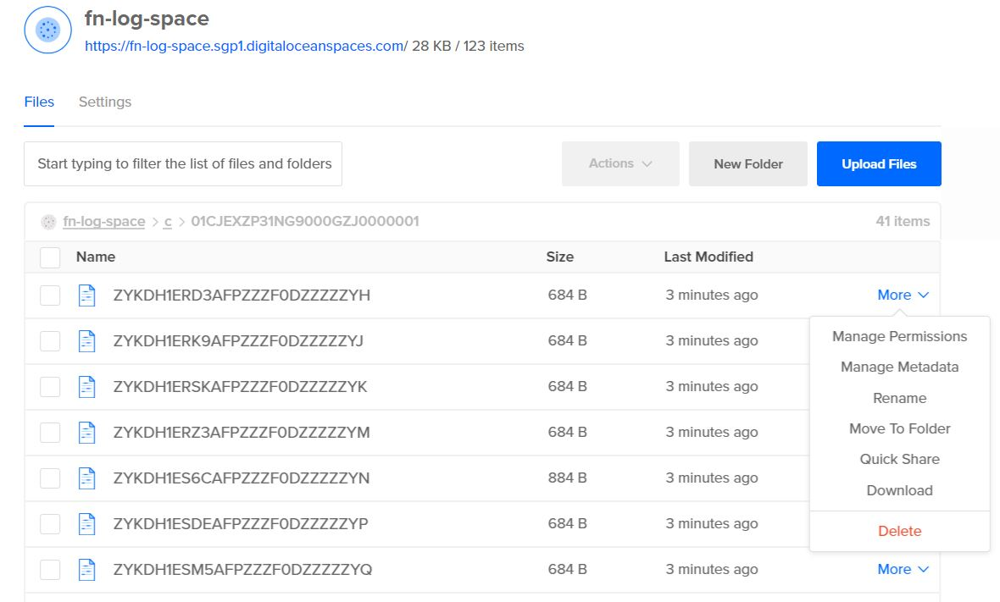

You can `Download` the log to see the details

		{
		  "id": "01CJEYH7JWNG9000GZJ000001E",
		  "status": "success",
		  "path": "/hello",
		  "image": "hello:0.0.2",
		  "type": "sync",
		  "format": "json",
		  "url": "http://localhost:8080/r/myapp/hello",
		  "method": "POST",
		  "priority": 0,
		  "timeout": 30,
		  "idle_timeout": 30,
		  "memory": 128,
		  "config": {
		    "FN_APP_NAME": "myapp",
		    "FN_FORMAT": "json",
		    "FN_MEMORY": "128",
		    "FN_PATH": "/hello",
		    "FN_TMPSIZE": "0",
		    "FN_TYPE": "sync"
		  },
		  "headers": {
		    "Accept": [
		      "*/*"
		    ],
		    "Content-Length": [
		      "17"
		    ],
		    "Content-Type": [
		      "application/x-www-form-urlencoded"
		    ],
		    "User-Agent": [
		      "curl/7.47.0"
		    ]
		  },
		  "completed_at": "2018-07-15T12:27:05.200Z",
		  "created_at": "2018-07-15T12:27:05.180Z",
		  "started_at": "2018-07-15T12:27:05.180Z",
		  "app_id": "01CJEXZP31NG9000GZJ0000001",
		  "trigger_id": "",
		  "fn_id": ""
		}

## Access Spaces with AWS S3 client

Let's use the AWS S3 Go client to manipulate Spaces programatically. It will will create a new Space, list existing Spaces, try to delete all the Spaces

- You need [Go](https://golang.org) [installed](https://golang.org/doc/install)
- Fetch libraries
	- `github.com/aws/aws-sdk-go/aws`
	- `github.com/aws/aws-sdk-go/aws/credentials`
	- `github.com/aws/aws-sdk-go/aws/session`
	- `github.com/aws/aws-sdk-go/service/s3`
- Execute - `go run do-spaces-using-aws-s3-client.go --SPACES_ACCESS_KEY=<SPACES_ACCESS_KEY> --SPACES_ACCESS_KEY_SECRET=<SPACES_ACCESS_KEY_SECRET> --SPACES_ENDPOINT=<SPACES_ENDPOINT>` e.g. `go run do-spaces-using-aws-s3-client.go --SPACES_ACCESS_KEY=qwerty1234 --SPACES_ACCESS_KEY_SECRET=1234qwerty --SPACES_ENDPOINT=sgp1.digitaloceanspaces.com --CREATE_SPACE_NAME=my-test-space` 

## Delete resources

It easy to delete a Droplet using the UI - from the [Control Panel](https://cloud.digitalocean.com/dashboard), click the Droplet’s More menu and choose **Delete**

Check your DigitalOcean [dashboard](https://cloud.digitalocean.com/dashboard) to confirm Droplet deletion
